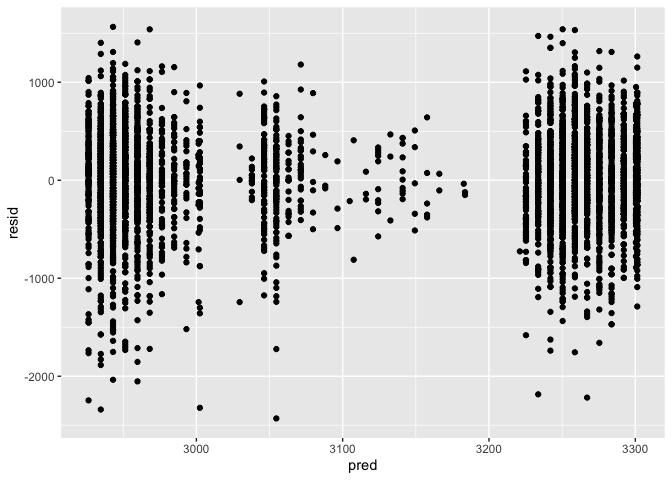

p8105_hw6_vk2480
================
Vasuda Kapoor
2022-12-03

Library calls

``` r
library(tidyverse)
```

    ## ── Attaching packages ─────────────────────────────────────── tidyverse 1.3.2 ──
    ## ✔ ggplot2 3.3.6      ✔ purrr   0.3.5 
    ## ✔ tibble  3.1.8      ✔ dplyr   1.0.10
    ## ✔ tidyr   1.2.1      ✔ stringr 1.4.1 
    ## ✔ readr   2.1.3      ✔ forcats 0.5.2 
    ## ── Conflicts ────────────────────────────────────────── tidyverse_conflicts() ──
    ## ✖ dplyr::filter() masks stats::filter()
    ## ✖ dplyr::lag()    masks stats::lag()

``` r
library("modelr")
```

# Problem 1

``` r
weather_df = 
  rnoaa::meteo_pull_monitors(
    c("USW00094728"),
    var = c("PRCP", "TMIN", "TMAX"), 
    date_min = "2017-01-01",
    date_max = "2017-12-31") %>%
  mutate(
    name = recode(id, USW00094728 = "CentralPark_NY"),
    tmin = tmin / 10,
    tmax = tmax / 10) %>%
  select(name, id, everything())
```

    ## Registered S3 method overwritten by 'hoardr':
    ##   method           from
    ##   print.cache_info httr

    ## using cached file: ~/Library/Caches/R/noaa_ghcnd/USW00094728.dly

    ## date created (size, mb): 2022-10-09 15:57:47 (8.411)

    ## file min/max dates: 1869-01-01 / 2022-10-31

``` r
weather_df %>% 
  modelr::bootstrap(n = 1000) %>% 
  mutate(
    models = map(strap, ~lm(tmax ~ tmin, data = .x) ),
    results = map(models, broom::glance)) %>% 
  select(-strap, -models) %>% 
  unnest(results) %>% 
  ggplot(aes(x = r.squared)) + geom_density()
```

<!-- -->

``` r
weather_df %>% 
  modelr::bootstrap(n = 1000) %>% 
  mutate(
    models = map(strap, ~lm(tmax ~ tmin, data = .x) ),
    results = map(models, broom::tidy)) %>% 
  select(-strap, -models) %>% 
  unnest(results) %>% 
  select(id = `.id`, term, estimate) %>% 
  pivot_wider(
    names_from = term, 
    values_from = estimate) %>% 
  rename(beta0 = `(Intercept)`, beta1 = tmin) %>% 
  mutate(log_b0b1 = log(beta0 * beta1)) %>% 
  ggplot(aes(x = log_b0b1)) + geom_density()
```

<!-- -->

# Problem 2

``` r
# DATA CLEANING
# load data and clean names
homicide_df = read_csv("homicide-data.csv") %>%
  janitor::clean_names()
```

    ## Rows: 52179 Columns: 12
    ## ── Column specification ────────────────────────────────────────────────────────
    ## Delimiter: ","
    ## chr (9): uid, victim_last, victim_first, victim_race, victim_age, victim_sex...
    ## dbl (3): reported_date, lat, lon
    ## 
    ## ℹ Use `spec()` to retrieve the full column specification for this data.
    ## ℹ Specify the column types or set `show_col_types = FALSE` to quiet this message.

``` r
#Create a city_state variable (e.g. “Baltimore, MD”), and a binary variable indicating whether the homicide is solved.
         
homicide_df = homicide_df %>%
  mutate(
    city_state = str_c(city, ", ",state),
    case_status = if_else( disposition == "Closed without arrest" | disposition == "Open/No arrest", "Unsolved", "Solved"), 
    case_status = as.numeric(case_status == "Solved")
  )

# Omit cities Dallas, TX; Phoenix, AZ; and Kansas City, MO – these don’t report victim race. Also omit Tulsa, AL.
homicide_df = homicide_df %>%
  filter(!(city_state %in% c("Dallas, TX", "Phoenix, AZ", "Kansas City, MO", "Tulsa, AL")))

# Limit your analysis to those for whom victim_race is white or black. Be sure that victim_age is numeric.

homicide_df = homicide_df %>%
  filter(victim_race %in% c("White", "Black")) %>%
  mutate(
    victim_age = as.numeric(victim_age)
  )
```

    ## Warning in mask$eval_all_mutate(quo): NAs introduced by coercion

``` r
city_homicide_df2 = homicide_df %>%
  nest(df = city_state) 
```

``` r
#REGRESSION MODEL
#For the city of Baltimore, MD, use the glm function to fit a logistic regression with resolved vs unresolved as the outcome and victim age, sex and race as predictors.
baltimore_df = homicide_df %>%
  filter(city == "Baltimore")

fit_logistic = 
  baltimore_df %>% 
  glm(case_status ~ victim_age + victim_race + victim_sex, data = ., family = binomial()) 

#Save the output of glm as an R object; apply the broom::tidy to this object; and obtain the estimate and confidence interval of the adjusted odds ratio for solving homicides comparing male victims to female victims keeping all other variables fixed.

fit_logistic = fit_logistic %>%
  broom::tidy(conf.int = TRUE) %>%
  janitor::clean_names() %>%
  mutate(
    OR = exp(estimate),
    OR_conf_low = exp(conf_low),
    OR_conf_high = exp(conf_high),
    CI = str_c(OR_conf_low, ", ",OR_conf_high)) %>%
  filter(term == "victim_sexMale") %>%
  select(OR, CI)
fit_logistic 
```

    ## # A tibble: 1 × 2
    ##      OR CI                                  
    ##   <dbl> <chr>                               
    ## 1 0.426 0.324190803533964, 0.557550782471228

``` r
#MAPPING WITH REGRESSION
#Now run glm for each of the cities in your dataset, and extract the adjusted odds ratio (and CI) for solving homicides comparing male victims to female victims. Do this within a “tidy” pipeline, making use of purrr::map, list columns, and unnest as necessary to create a dataframe with estimated ORs and CIs for each city.


nest_glm_homicide =
  homicide_df %>% 
  group_by(city_state) %>%
  nest(df = -city_state) %>% 
  mutate(
    models = map(df, ~glm(case_status ~ victim_age + victim_sex + victim_race, data = .x, family = binomial())),
    results = map(models, broom::tidy, conf.int = TRUE)) %>% 
  select(-df, -models) %>% 
  unnest(cols = results) %>%
  janitor::clean_names() %>%
  mutate(
    OR = exp(estimate),
    OR_conf_low = exp(conf_low),
    OR_conf_high = exp(conf_high),
    CI = str_c(OR_conf_low, ", ",OR_conf_high)) %>%
  filter(term == "victim_sexMale") %>%
  select(city_state, OR, OR_conf_low, OR_conf_high, CI)
```

    ## Warning: glm.fit: fitted probabilities numerically 0 or 1 occurred

    ## Warning: glm.fit: fitted probabilities numerically 0 or 1 occurred

    ## Warning: glm.fit: fitted probabilities numerically 0 or 1 occurred

    ## Warning: glm.fit: fitted probabilities numerically 0 or 1 occurred

    ## Warning: glm.fit: fitted probabilities numerically 0 or 1 occurred

    ## Warning: glm.fit: fitted probabilities numerically 0 or 1 occurred

    ## Warning: glm.fit: fitted probabilities numerically 0 or 1 occurred

    ## Warning: glm.fit: fitted probabilities numerically 0 or 1 occurred

    ## Warning: glm.fit: fitted probabilities numerically 0 or 1 occurred

    ## Warning: glm.fit: fitted probabilities numerically 0 or 1 occurred

    ## Warning: glm.fit: fitted probabilities numerically 0 or 1 occurred

    ## Warning: glm.fit: fitted probabilities numerically 0 or 1 occurred

    ## Warning: glm.fit: fitted probabilities numerically 0 or 1 occurred

    ## Warning: glm.fit: fitted probabilities numerically 0 or 1 occurred

    ## Warning: glm.fit: fitted probabilities numerically 0 or 1 occurred

    ## Warning: glm.fit: fitted probabilities numerically 0 or 1 occurred

    ## Warning: glm.fit: fitted probabilities numerically 0 or 1 occurred

    ## Warning: glm.fit: fitted probabilities numerically 0 or 1 occurred

    ## Warning: glm.fit: fitted probabilities numerically 0 or 1 occurred

    ## Warning: glm.fit: fitted probabilities numerically 0 or 1 occurred

    ## Warning: glm.fit: fitted probabilities numerically 0 or 1 occurred

    ## Warning: glm.fit: fitted probabilities numerically 0 or 1 occurred

    ## Warning: glm.fit: fitted probabilities numerically 0 or 1 occurred

    ## Warning: glm.fit: fitted probabilities numerically 0 or 1 occurred

    ## Warning: glm.fit: fitted probabilities numerically 0 or 1 occurred

    ## Warning: glm.fit: fitted probabilities numerically 0 or 1 occurred

    ## Warning: glm.fit: fitted probabilities numerically 0 or 1 occurred

    ## Warning: glm.fit: fitted probabilities numerically 0 or 1 occurred

    ## Warning: glm.fit: fitted probabilities numerically 0 or 1 occurred

    ## Warning: glm.fit: fitted probabilities numerically 0 or 1 occurred

    ## Warning: glm.fit: fitted probabilities numerically 0 or 1 occurred

    ## Warning: glm.fit: fitted probabilities numerically 0 or 1 occurred

    ## Warning: glm.fit: fitted probabilities numerically 0 or 1 occurred

    ## Warning: glm.fit: fitted probabilities numerically 0 or 1 occurred

    ## Warning: glm.fit: fitted probabilities numerically 0 or 1 occurred

    ## Warning: glm.fit: fitted probabilities numerically 0 or 1 occurred

    ## Warning: glm.fit: fitted probabilities numerically 0 or 1 occurred

    ## Warning: glm.fit: fitted probabilities numerically 0 or 1 occurred

    ## Warning: glm.fit: fitted probabilities numerically 0 or 1 occurred

    ## Warning: glm.fit: fitted probabilities numerically 0 or 1 occurred

    ## Warning: glm.fit: fitted probabilities numerically 0 or 1 occurred

    ## Warning: glm.fit: fitted probabilities numerically 0 or 1 occurred

    ## Warning: glm.fit: fitted probabilities numerically 0 or 1 occurred

``` r
# PLOT
# Create a plot that shows the estimated ORs and CIs for each city. Organize cities according to estimated OR, and comment on the plot.
homicide_plot = nest_glm_homicide %>%
  ggplot(aes(x = reorder(city_state, OR), y = OR)) +
  geom_point() +
  geom_errorbar(aes(ymin = OR_conf_low, ymax = OR_conf_high)) +
  theme(legend.position = "none", 
         axis.text.x = element_text(angle = 90, hjust = 1)) +
  xlab("City")
homicide_plot
```

<!-- --> The
odds of a crime being solved, when comparing male to female victims, are
highest in Albuquerque, NM and lowes in New York, NY.

# Problem 3

``` r
# Load and clean the data for regression analysis (i.e. convert numeric to factor where appropriate, check for missing data, etc.).
library("labelled") 
bwt_df = read_csv("birthweight.csv") %>%
  janitor::clean_names() %>%
  set_value_labels(
    babysex = c("male" = 1, "female" = 2),
    frace = c("White" = 1, "Black" = 2, "Asian" = 3, "Puerto Rican" = 4, "Other" = 8, "Unknown" = 9),
    malform = c("absent" = 0, "present" = 1),
    mrace = c("White" = 1, "Black" = 2, "Asian" = 3, "Puerto Rican" = 4, "Other" = 8)
  ) %>%
  mutate_if(is.labelled, to_factor)
```

    ## Rows: 4342 Columns: 20
    ## ── Column specification ────────────────────────────────────────────────────────
    ## Delimiter: ","
    ## dbl (20): babysex, bhead, blength, bwt, delwt, fincome, frace, gaweeks, malf...
    ## 
    ## ℹ Use `spec()` to retrieve the full column specification for this data.
    ## ℹ Specify the column types or set `show_col_types = FALSE` to quiet this message.

``` r
# Propose a regression model for birth weight.
proposed_mod = lm(bwt ~ fincome + mrace, data = bwt_df)
```

The predictors in the proposed model were chosen based on a a
hypothesized structure for the social factors that underly birth weight.

``` r
# Show a plot of model residuals against fitted values – use add_predictions and add_residuals in making this plot.
bwt_df %>% 
  modelr::add_predictions(proposed_mod) %>% 
  modelr::add_residuals(proposed_mod) %>%
  ggplot(aes(x = pred, y = resid)) + 
  geom_point() 
```

<!-- -->

``` r
# cross validation
# model 2: length at birth and gestational age as predictors (main effects only)
mod2 = lm(bwt ~ blength + momage, data = bwt_df)
# model 3: head circumference, length, sex, and all interactions (including the three-way interaction) between these. 
mod3 = lm(bwt ~ (bhead + blength + babysex)^2 + bhead*blength*babysex, data = bwt_df)
```

``` r
# cross validation

cv_df =
  modelr::crossv_mc(bwt_df, 100) %>% 
  mutate(
    train = map(train, as_tibble),
    test = map(test, as_tibble)) %>% 
  mutate(
    proposed_mod  = map(train, ~lm(bwt ~ fincome + mrace, data = .x)),
    mod2 = map(train, ~lm(bwt ~ blength + momage, data = .x)),
    mod3  = map(train, ~lm(bwt ~ (bhead + blength + babysex)^2 + bhead*blength*babysex, data = .x))) %>% 
  mutate(
    rmse_proposed = map2_dbl(proposed_mod, test, ~rmse(model = .x, data = .y)),
    rmse_mod2    = map2_dbl(mod2, test, ~rmse(model = .x, data = .y)),
    rmse_mod3 = map2_dbl(mod3, test, ~rmse(model = .x, data = .y)))

#make plot of rmse for comparison
cv_df %>% 
  select(starts_with("rmse")) %>% 
  pivot_longer(
    everything(),
    names_to = "model", 
    values_to = "rmse",
    names_prefix = "rmse_") %>% 
  mutate(model = fct_inorder(model)) %>% 
  ggplot(aes(x = model, y = rmse)) + geom_violin()
```

<!-- -->
Model three has the lowest rmse, so it seems to be the best model.
